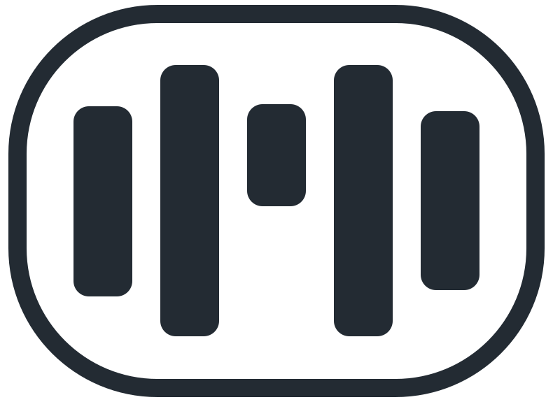

<p align="center">
  <br><br>
  
</p>

<p align="center"><b>Local, offline voice dictation for macOS (Apple Silicon).</b></p>

---

Hold a shortcut, talk, release: your words are typed where your cursor is. Everything runs on your Mac — **the audio never leaves it**.

[**Download the latest version**](https://github.com/charlespolart/mumo-releases/releases/latest) · [All releases](https://github.com/charlespolart/mumo-releases/releases) · [Release notes](CHANGELOG.md)

This repository only hosts the **binaries** and the **update feed**. The source code is private.

## What it does

- **Dictate anywhere** with a global shortcut (or the Fn / Globe key), in any app. Push-to-talk, or hands-free (double-tap to start, tap to finish).
- **On-device transcription** with Whisper (WhisperKit, Core ML / Apple Neural Engine): ~99 languages with automatic detection; Chinese can be forced to Simplified or Traditional.
- **Live preview**: your words appear while you speak.
- **Styles**: Raw, Clean, Formal, Concise, E-mail — or your own custom styles — applied on your Mac by a local language model. Custom styles can optionally use a cloud API with your own key (text only, never audio).
- **Per-app styles**, and a style picker in the Dynamic Island (notched Macs) or in the pill at the bottom of the screen.
- **Translate** or **restyle** any selected text from the menu.
- **Personal dictionary**: names and jargon are boosted during recognition, not just corrected afterwards. Voice snippets: say a phrase, get the text.
- **History** with search, audio playback, one-click re-run with another style, and recovery of dismissed dictations.
- Menu bar app, launch at login, interface in English, French, Simplified and Traditional Chinese.

## Requirements

- macOS **14 Sonoma** or later.
- **Apple Silicon** (M1 or later). Intel Macs are not supported.
- About 1 GB of free disk space for the speech model, downloaded on first launch. The optional style model (~4.3 GB) is downloaded on demand from Settings.

## Install

1. Download `Mumo.dmg` and open it.
2. Drag **Mumo** to **Applications**, then launch it.
3. Follow the short onboarding: microphone access, accessibility permission (needed to type the text for you), model download.

The app is signed with an Apple Developer ID and notarized by Apple: it opens without any Gatekeeper workaround. To verify a download:

```sh
spctl --assess --type open --context context:primary-signature -v Mumo.dmg
```

## Updates

Mumo checks for updates automatically once a day, quietly: when a new version is available, a badge appears on the menu bar icon and the menu offers **Update to X.Y.Z…**. Updates are signed (EdDSA) and installed only when you ask. You can also pick **Check for Updates…** at any time. Release notes are shown once after each update.

Update feed (Sparkle appcast): `https://raw.githubusercontent.com/charlespolart/mumo-releases/master/appcast.xml`

## Privacy

- Audio is processed on your Mac and never uploaded.
- Nothing is sent anywhere by default. If you *choose* to configure a cloud style with your own API key, only the transcribed text is sent — never the audio, never your dictionary.
- Dictation history stays in your user folder; audio retention is a setting.

## Problems and feedback

Open an issue in this repository, or write to the author via [charlespolart.com](https://charlespolart.com).
